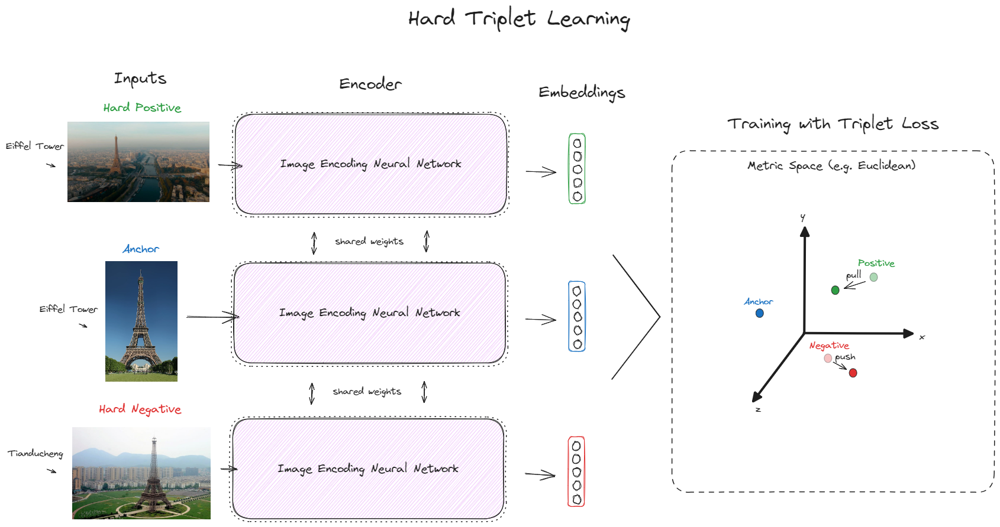

<!--- BADGES: START --->


<!--- BADGES: END --->
# SuperTriplets
SuperTriplets is a toolbox for supervised online hard triplet learning, currently supporting different kinds of data: text, image, and even text + image (multimodal).  
It doesn't try to automate the training and evaluation loop for you. Instead, it provides useful PyTorch-based utilities you can couple to your existing code, making the process as easy as performing other everyday supervised learning tasks, such as classification and regression.

## Installation and Supported Versions
SuperTriplets is available on PyPI:
```console
$ pip install supertriplets
```
SuperTriplets officially supports Python 3.8+.
## Quick Start
### Training
Update your model weights with batch hard triplet losses over label balanced batches:
```python
import torch

from supertriplets.dataset import OnlineTripletsDataset
from supertriplets.distance import EuclideanDistance
from supertriplets.loss import BatchHardTripletLoss
from supertriplets.sample import TextImageSample

# ... omitted code to load the pandas.Dataframe `train_df`

device = 'cuda:0' if torch.cuda.is_available() else 'cpu'  # always use cuda if available

# SuperTriplets provides very basic `sample` classes to store and manipulate datapoints
train_examples = [
    TextImageSample(text=text, image_path=image_path, label=label)
    for text, image_path, label in zip(train_df['text'], train_df['image_path'], train_df['label'])
]

def my_sample_loading_func(text, image_path, label, *args, **kwargs):
    # ... implement your own preprocessing logic: e.g. tokenization, augmentations, tensor creation, etc
    # this usually contains similar logic to what you would use inside a torch.utils.data.Dataset `__get_item__` method
    # the only requirement is that it should at least have a few parameters named like its `sample` class attributes
    loaded_sample = {"text_input": prep_text, "image_input": prep_image, "label": prep_label}
    return loaded_sample

# subclass of torch.utils.data.IterableDataset
# it loops over examples to make sure each batch has the same number of
# samples per label and every sample is seen once per epoch
train_dataset = OnlineTripletsDataset(
    examples=train_examples,
    in_batch_num_samples_per_label=2,  # labels with less than this will be discarded
    batch_size=32,  # multiple of `in_batch_num_samples_per_label`
    sample_loading_func=my_sample_loading_func,
    sample_loading_kwargs={}  # you could add parameters to `my_sample_loading_func` and pass them here
)

# simple torch.utils.data.DataLoader, should match `batch_size` with `train_dataset`
train_dataloader = DataLoader(dataset=train_dataset, batch_size=32, num_workers=0, drop_last=True)

# SuperTriplets implement a variety of batch hard triplet losses and distances
criterion = BatchHardTripletLoss(distance=EuclideanDistance(squared=False), margin=5)

model = # init your torch model
optimizer = # init your torch optimizer
num_epochs = # define the number of training epochs

# basic training loop
for epoch in range(1, num_epochs + 1):
    for batch in train_dataloader:
        data = batch["samples"]  # batch preprocessing result of `train_dataset.sample_loading_func`
        labels = move_tensors_to_device(obj=data.pop("label"), device=device)  # helper to move tensors within lists and dicts recursively between devices
        inputs = move_tensors_to_device(obj=data, device=device)

        optimizer.zero_grad()

        embeddings = model(**inputs)
        loss = criterion(embeddings=embeddings, labels=labels)  # finds and uses the batch hardest triplets to update gradients

        loss.backward()
        optimizer.step()
```
### Evaluation
Mine hard triplets with pretrained models to construct your static testing dataset:
```python
import torch

from supertriplets.sample import TextImageSample
from supertriplets.encoder import PretrainedSampleEncoder
from supertriplets.evaluate import HardTripletsMiner
from supertriplets.dataset import StaticTripletsDataset

# ... omitted code to load the pandas.Dataframe `test_df`

device = 'cuda:0' if torch.cuda.is_available() else 'cpu'  # always use cuda if available

# SuperTriplets provides very basic `sample` classes to store and manipulate datapoints
test_examples = [
    TextImageSample(text=text, image_path=image_path, label=label)
    for text, image_path, label in zip(test_df['text'], test_df['image_path'], test_df['label'])
]

# Leverage general purpose pretrained models per language and data format or bring your own `test_embeddings`
pretrained_encoder = PretrainedSampleEncoder(modality="text_english-image")
test_embeddings = pretrained_encoder.encode(examples=test_examples, device=device, batch_size=32)

# Index `test_examples` using `test_embeddings` and perform nearest neighbor search to sample hard positives and hard negatives
hard_triplet_miner = HardTripletsMiner(use_gpu_powered_index_if_available=True)
test_anchors, test_positives, test_negatives = hard_triplet_miner.mine(
    examples=test_examples, embeddings=test_embeddings, normalize_l2=True, sample_from_topk_hardest=10
)

def my_sample_loading_func(text, image_path, label, *args, **kwargs):
    # ... implement your own preprocessing logic: e.g. tokenization, augmentations, tensor creation, etc
    # this usually contains similar logic to what you would use inside a torch.utils.data.Dataset `__get_item__` method
    # the only requirement is that it should at least have a few parameters named like its `sample` class attributes
    loaded_sample = {"text_input": prep_text, "image_input": prep_image, "label": prep_label}
    return loaded_sample

# just another subclass of torch.utils.data.Dataset
test_dataset = StaticTripletsDataset(
    anchor_examples=test_anchor_examples,
    positive_examples=test_positive_examples,
    negative_examples=test_negative_examples,
    sample_loading_func=my_sample_loading_func,
    sample_loading_kwargs={}  # you could add parameters to `my_sample_loading_func` and pass them here
)
```
Easily create a good baseline with pretrained models and utilities to measure model accuracies on triplets using a diverse set of distance measurements:
```python
from torch.utils.data import DataLoader
from tqdm import tqdm

from supertriplets.evaluate import TripletEmbeddingsEvaluator
from supertriplets.models import load_pretrained_model
from supertriplets.utils import move_tensors_to_device


model = load_pretrained_model(model_name="CLIPViTB32EnglishEncoder")  # see the list of pretrained models or bring your own model
model.to(device)
model.eval()

# very basic torch.utils.data.DataLoader to loop through the `test_dataset`
test_dataloader = DataLoader(dataset=test_dataset, batch_size=32, shuffle=False, num_workers=0, drop_last=False)

# bring your own logic to calculate embeddings
def get_triplet_embeddings(dataloader, model, device):
    model.eval()
    embeddings = {"anchors": [], "positives": [], "negatives": []}
    with torch.no_grad():
        for batch in tqdm(dataloader, total=len(dataloader)):
            # a batch contains the preprocessing result for anchors, positives and negatives samples
            for input_type in ["anchors", "positives", "negatives"]:
                inputs = {k: v for k, v in batch[input_type].items() if k != "label"}
                inputs = move_tensors_to_device(obj=inputs, device=device)  # helper to move tensors within lists and dicts recursively between devices
                batch_embeddings = model(**inputs).cpu()
                embeddings[input_type].append(batch_embeddings)
    embeddings = {k: torch.cat(v, dim=0).numpy() for k, v in embeddings.items()}
    return embeddings

# evaluate any model encodings accuracy on existing triplets
# accuracy is the percentage of triplets where dist(a, p) < dist(a, n)
triplet_embeddings_evaluator = TripletEmbeddingsEvaluator(
    calculate_by_cosine=True, calculate_by_manhattan=True, calculate_by_euclidean=True
)

test_triplet_embeddings = get_triplet_embeddings(dataloader=test_dataloader, model=model, device=device)

# `test_baseline_accuracies` is a dict of accuracies calculated using chosen distance measures
test_baseline_accuracies = triplet_embeddings_evaluator.evaluate(
    embeddings_anchors=test_triplet_embeddings["anchors"],
    embeddings_positives=test_triplet_embeddings["positives"],
    embeddings_negatives=test_triplet_embeddings["negatives"],
)
# ... continue using `triplet_embeddings_evaluator` within your evaluation loops
```
## Local Development
Make sure you have python3, python3-venv and make installed.  
Create a virtual environment with an editable installation of SuperTriplets and development specific dependencies by running:
```console
$ make install
```
Activate `.venv`:
```console
$ source .venv/bin/activate
```
Now you can make changes and test them with pytest.  
Testing without a GPU:
```console
$ python -m pytest -k "not test_tinymmimdb_convergence"
```
With a GPU:
```console
$ python -m pytest
```
## Changelog
See [CHANGELOG.md](CHANGELOG.md) for news on all SuperTriplets versions.
## License
See [LICENSE](LICENSE.txt) for the current license.